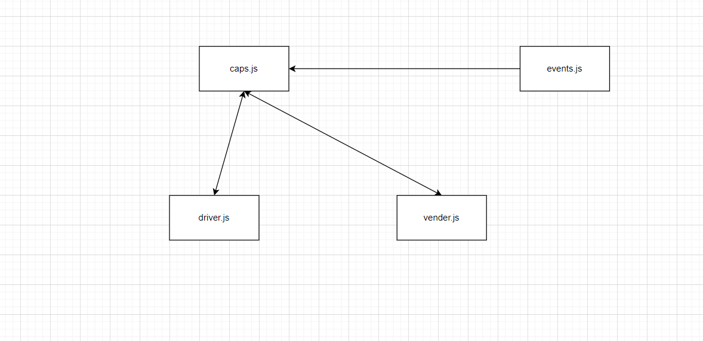

# CAPS

CAPS Phase 1: Begin the build of an application for a company called CAPS - The Code Academy Parcel Service. In this sprint, we’ll build out a system that emulates a real world supply chain. CAPS will simulate a delivery service where vendors (such a flower shops) will ship products using our delivery service and when our drivers deliver them, be notified that their customers received what they purchased.

# Author 
 Ahmad Arman 

## link 

[repository](https://github.com/ahmad-arman/CAPS) 
[pull request](https://github.com/ahmad-arman/CAPS/pulls/1) 
[action](https://github.com/ahmad-arman/CAPS/actions) 

# API 
1- Clone down repository from GitHub
2-run in your terminal  npm jest dotenv faker
3- run in your terminal node capes

## UMl 
